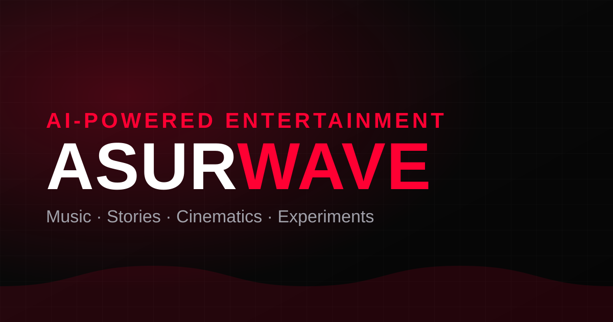

<div align="center">



# 🌊 AsurWave

### AI-Powered Entertainment — Music · Stories · Cinematics · Experiments

A modern, accessible, production-ready landing page for an AI-entertainment
channel. Built as an open-source reference for a polished, SaaS-quality static
site.

[](https://github.com/aashishbharti04/asurwave/actions/workflows/ci.yml)
[](https://github.com/aashishbharti04/asurwave/actions/workflows/deploy.yml)
[](LICENSE)
[](tsconfig.json)
[](https://vitejs.dev)
[](https://tailwindcss.com)
[](CONTRIBUTING.md)

[Live Demo](https://aashishbharti04.github.io/asurwave/) ·
[Report Bug](https://github.com/aashishbharti04/asurwave/issues/new?template=bug_report.yml) ·
[Request Feature](https://github.com/aashishbharti04/asurwave/issues/new?template=feature_request.yml)

</div>

---

## 📖 Table of Contents

- [Overview](#-overview)
- [Features](#-features)
- [Screenshots](#-screenshots)
- [Tech Stack](#-tech-stack)
- [Installation](#-installation)
- [Usage](#-usage)
- [Configuration](#-configuration)
- [Deployment](#-deployment)
- [Project Structure](#-project-structure)
- [Documentation](#-documentation)
- [Contributing](#-contributing)
- [FAQ](#-faq)
- [License](#-license)
- [Contact](#-contact)

## 🌊 Overview

**AsurWave** is the landing page for an AI-powered entertainment channel —
original music, visual stories, cinematic videos, and creative experiments.

It began life as a single 552-line HTML file and was transformed into a
maintainable, accessible, and performant open-source project **without changing
the design or losing any functionality**. It now ships as an optimized static
site with a real build pipeline, full light/dark theming, automated CI/CD, and
complete documentation — a practical reference for "how to take a quick page to
production quality."

## ✨ Features

- 🎨 **Premium dark-first design** with neon-glitch hero, smooth animations, and
  a fully matched **light theme**.
- 🌗 **Light & dark mode** — system-preference aware, one-click toggle, persisted,
  with no flash of the wrong theme on load.
- ⚡ **Fast by default** — compiled & purged Tailwind (~6 kB gzipped CSS), ~2 kB
  gzipped JS, content-hashed assets, and **click-to-load** YouTube facades that
  keep third-party iframes off the critical path.
- ♿ **Accessible** — semantic landmarks, skip link, full keyboard support,
  managed focus, visible focus rings, and `prefers-reduced-motion` support.
- 🔍 **SEO-ready** — canonical URL, Open Graph & Twitter cards, JSON-LD,
  `robots.txt`, `sitemap.xml`, web manifest, and an SVG favicon.
- 📱 **Responsive** — tuned for mobile, tablet, and desktop.
- 🛡️ **Secure defaults** — no secrets in the client, `rel="noopener noreferrer"`
  on outbound links, and privacy-friendly `youtube-nocookie` embeds.
- 🧰 **Great DX** — TypeScript (strict), ESLint, Prettier, Vitest, and a single
  `npm run check` that mirrors CI.
- 🤖 **CI/CD** — GitHub Actions for verification and one-click GitHub Pages deploys.

## 📸 Screenshots

> Add your own captures to [`docs/screenshots/`](docs/screenshots) — see the
> [screenshot guide](docs/screenshots/README.md).

| Dark theme                              | Light theme                               |
| --------------------------------------- | ----------------------------------------- |
|  |  |

## 🛠 Tech Stack

| Area       | Choice                                       |
| ---------- | -------------------------------------------- |
| Build tool | [Vite](https://vitejs.dev)                   |
| Language   | [TypeScript](https://www.typescriptlang.org) |
| Styling    | [Tailwind CSS](https://tailwindcss.com)      |
| Testing    | [Vitest](https://vitest.dev) + jsdom         |
| Quality    | ESLint + Prettier                            |
| CI/CD      | GitHub Actions → GitHub Pages                |

No UI framework — the shipped output is plain HTML, CSS, and a small amount of
progressive-enhancement JavaScript.

## 🚀 Installation

> Requires **Node.js 18+** and npm.

```bash
# Clone
git clone https://github.com/aashishbharti04/asurwave.git
cd asurwave

# Install
npm install

# Start the dev server → http://localhost:5173
npm run dev
```

## 📦 Usage

```bash
npm run dev          # Dev server with hot reload
npm run build        # Type-check + production build → dist/
npm run preview      # Preview the production build
npm run lint         # Lint with ESLint
npm run format       # Format with Prettier
npm run typecheck    # Type-check only
npm test             # Run unit tests
npm run check        # Run the full CI pipeline locally
```

**Editing content:** page content is semantic HTML in `index.html`.
**Adding a real video:** set a `data-youtube-id` on a card in `index.html` and
it will play inline on click (otherwise the card links to the channel).
**Theming:** use the semantic utilities (`bg-canvas`, `text-content`,
`border-line`, …) so both themes keep working.

## ⚙️ Configuration

Copy the example environment file and adjust:

```bash
cp .env.example .env
```

| Variable             | Description                                      | Exposed to client |
| -------------------- | ------------------------------------------------ | :---------------: |
| `VITE_SITE_URL`      | Canonical site URL for SEO/meta.                 |        ✅         |
| `VITE_CONTACT_EMAIL` | Public contact email.                            |        ✅         |
| `BASE_PATH`          | Deploy sub-path (e.g. `/asurwave/`), build-time. |        ❌         |

> ⚠️ Only `VITE_`-prefixed variables reach the browser bundle. **Never put
> secrets in them.**

Brand colors, fonts, and animations live in
[`tailwind.config.js`](tailwind.config.js); theme tokens live in
[`src/styles/main.css`](src/styles/main.css).

## 🌐 Deployment

This repo auto-deploys to **GitHub Pages** via GitHub Actions. In short:

1. Push to GitHub.
2. **Settings → Pages → Source → GitHub Actions**.
3. Push to `main` — it builds and publishes automatically.

Vercel, Netlify, Cloudflare Pages, or any static host work too. Full instructions
(including `BASE_PATH` and recommended security headers) are in
[`docs/DEPLOYMENT.md`](docs/DEPLOYMENT.md).

## 📁 Project Structure

A high-level view (full breakdown in
[`docs/FOLDER_STRUCTURE.md`](docs/FOLDER_STRUCTURE.md)):

```
asurwave/
├── index.html          # Semantic page content & app shell
├── public/             # Static assets (favicon, og-image, robots, sitemap…)
├── src/
│   ├── main.ts         # Entry point
│   ├── modules/        # theme · mobileMenu · smoothScroll · scrollReveal · videoFacade
│   ├── styles/         # Tailwind layers + theme tokens + components
│   ├── data/ · types/  # Site constants & shared types
├── tests/              # Vitest unit tests
├── docs/               # Architecture, deployment & development guides
└── .github/            # Workflows, issue/PR templates, Dependabot
```

## 📚 Documentation

- [Architecture](docs/ARCHITECTURE.md) — how it all fits together
- [Folder Structure](docs/FOLDER_STRUCTURE.md) — where everything lives
- [Development Setup](docs/DEVELOPMENT.md) — local dev guide
- [Deployment](docs/DEPLOYMENT.md) — hosting & security headers
- [Contributing](CONTRIBUTING.md) · [Security](SECURITY.md) · [Code of Conduct](CODE_OF_CONDUCT.md) · [Changelog](CHANGELOG.md)

## 🤝 Contributing

Contributions are welcome! Please read the
[Contributing Guide](CONTRIBUTING.md) and our
[Code of Conduct](CODE_OF_CONDUCT.md). Good first steps:

1. Fork the repo and create a branch (`git checkout -b feat/amazing-thing`).
2. Make your change; run `npm run check`.
3. Open a pull request using the template.

## ❓ FAQ

<details>
<summary><b>Why no React/Vue/Next.js?</b></summary>

It's a content-focused landing page. Plain semantic HTML with a sprinkle of
TypeScript ships less code, loads faster, and stays fully accessible and
indexable without a framework runtime.

</details>

<details>
<summary><b>How do I add a real YouTube video?</b></summary>

In `index.html`, set the `data-youtube-id` attribute on a creation card to the
11-character video id. It will load and autoplay inline on click. Left empty, the
card gracefully links to the channel instead.

</details>

<details>
<summary><b>How does the light/dark theme work?</b></summary>

Colors are semantic CSS-variable tokens. The dark theme is the default; adding
the `.light` class to `<html>` swaps every token. An inline script applies the
saved/preferred theme before first paint to avoid flicker. See
[ARCHITECTURE.md](docs/ARCHITECTURE.md).

</details>

<details>
<summary><b>My assets 404 after deploying to GitHub Pages.</b></summary>

Set `BASE_PATH` to your repo sub-path (e.g. `/asurwave/`). The included deploy
workflow does this automatically. See [DEPLOYMENT.md](docs/DEPLOYMENT.md).

</details>

<details>
<summary><b>Is it really production-ready?</b></summary>

Yes — compiled/purged CSS, lazy third-party embeds, strict typing, automated
tests, CI on every PR, and security-conscious defaults. See
[CHANGELOG.md](CHANGELOG.md) for everything that changed.

</details>

## 📄 License

Distributed under the **MIT License**. See [`LICENSE`](LICENSE) for details.

This project is open source and available for **education, learning, and
community contributions**.

## 📬 Contact

**Aashish Bharti** — [aashish@marketdoctorsonline.com](mailto:aashish@marketdoctorsonline.com)

[](https://in.linkedin.com/in/aashana1012)
[](https://github.com/aashishbharti04)
[](https://www.youtube.com/@CodeWithAsur)
[](https://www.instagram.com/asurwave1012?igsh=ZDBlY2NtczJ5cmMw)

---

<div align="center">

© <span>2025</span> **AsurWave**. All rights reserved. · Built with 🌊 and open source for everyone.

</div>
